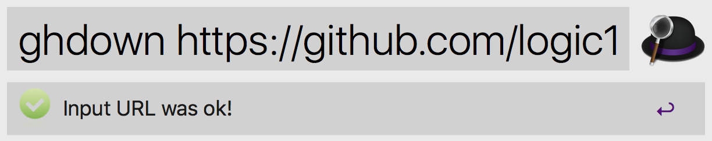
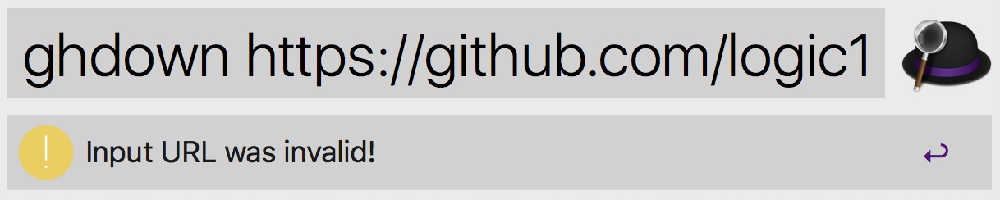

AlfredHiddenFilesToggle
================

Alfred Workflow for download a specific folder in GitHub.

Test passed in Alfred3 and MacOS 10.12.

## Install

- Download `Github Folder Downloader.alfredworkflow`.

- Install it by double-click.

## Usage

- Just type **`ghdown <github_folder_path>`**, for example:

 `ghdown https://github.com/logic1988/AlfredGithubFolderDownloader/tree/master/src` 

 

If the input path is invalid, you will see:

 

The downloaded file will be saved to the folder directory **`~/Downloads`** by default.

If the download is successful, there will be a notification:
 
 
